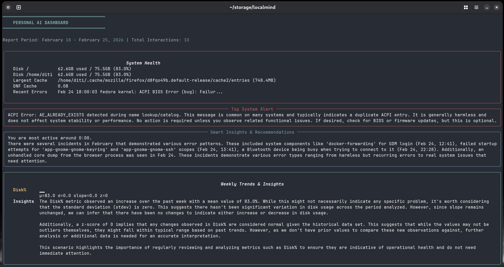
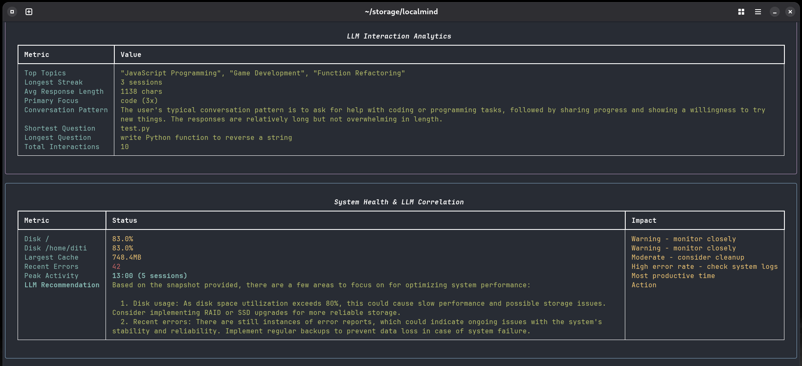
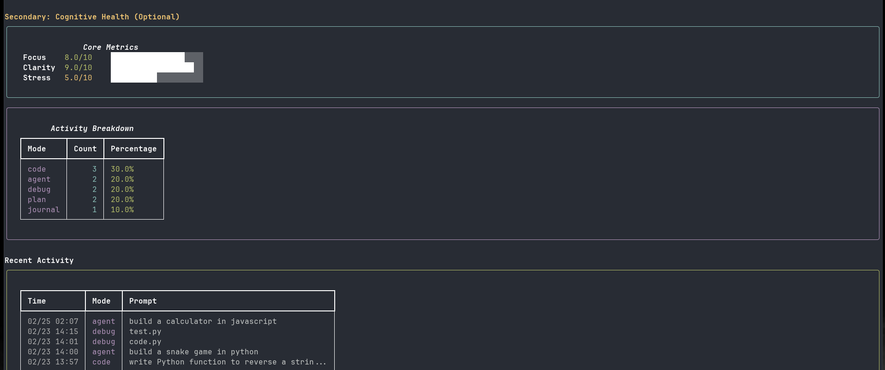

# LocalMind
## A Local-First Cognitive & LLM Observability Engine for Developers
LocalMind is a local-first, privacy-respecting personal AI operations center for my personal system(fedora). It brings together system health monitoring, calendar and email integration, and LLM-powered insights—all in a unified terminal dashboard.note :the disk space was filled purposely for this exp




## Features

- **System Health Monitoring:**  
  View disk usage, cache sizes, kernel versions, and recent system errors. Get actionable recommendations and LLM-powered log triage.

- **Smart Insights & Recommendations:**  
  Get productivity suggestions, peak activity times, and proactive alerts based on your system and usage patterns.

- **Visual Trends & Anomalies:**  
  ASCII sparklines showing focus, clarity, stress, and disk usage trends over time.

- **LLM Interaction Analytics:**  
  Analyze your top topics, conversation streaks, response lengths, and interaction patterns with your local LLM.

- **System Health Timeline:**  
  Correlate system events (errors, disk/cache spikes) with your LLM usage patterns.

- **LLM-Powered Log Triage:**  
  Your local LLM analyzes system error logs and highlights the single most important entry requiring attention.

- **Personal Analytics:**  
  Track productivity, activity trends, and self-reflection metrics (focus, clarity, stress).

- **Extensible Architecture:**  
  Easily add new modes, integrations, or dashboard panels.

## Requirements

- Python 3.8+
- Ollama with Qwen-Lite model (`ollama pull qwen-lite`)
- SQLite (for logs and persistence)
- Rich library (`pip install rich`)

## Quick Start

1. **Clone the repository:**
   ```bash
   git clone https://github.com/yourusername/localmind.git
   cd localmind
   ```

2. **Install dependencies:**
   ```bash
   pip install -r requirements.txt
   ```

3. **Set up Ollama and Qwen-Lite:**
   ```bash
   ollama pull qwen-lite
   ```

4. **Run the dashboard:**
   ```bash
   python dashboard.py
   ```

## Usage

### View the Dashboard
```bash
python dashboard.py
```

### View the Weekly Summary
```bash
python brain.py weekly
```

### Run System Monitor
```bash
python brain.py sysmon
```

### Available Modes
- `code` - AI-powered code assistant
- `debug` - Debug mode with auto-fix capability
- `journal` - Journaling and reflection
- `plan` - Planning and goal setting
- `reflect` - Self-reflection mode
- `sysmon` - System monitoring (read-only)

## Project Structure

```
localmind/
├── brain.py                 # Main CLI and mode router
├── dashboard.py             # Main dashboard and panels
├── model.py                 # LLM wrapper (Qwen-Lite via Ollama)
├── memory.py                # Logging and persistence
├── dashboard_insights.py    # Smart insights and recommendations
├── dashboard_trends.py      # Visual trends and analytics
├── dashboard_analytics.py   # LLM interaction analytics
├── dashboard_timeline.py    # System health timeline
├── dashboard_alert.py       # LLM-powered log triage
├── modes/
│   ├── code.py             # Code mode
│   ├── debug.py            # Debug mode
│   ├── journal.py          # Journal mode
│   ├── plan.py             # Plan mode
│   ├── reflect.py          # Reflect mode
│   └── sysmon.py           # System monitor
├── brain.db                # SQLite database for logs
├── requirements.txt        # Python dependencies
└── README.md              # This file
```

## How It Works

LocalMind combines multiple data streams into a unified dashboard:

1. **System Health:** Uses `journalctl`, `rpm`, and system APIs to monitor disk, cache, errors, and kernels.
2. **LLM Analysis:** Passes logs, prompts, and system state to your local Qwen-Lite LLM for intelligent summaries and prioritization.
3. **Personal Metrics:** Tracks focus, clarity, and stress levels from your interactions.
4. **Dashboard Panels:** Displays all insights in a rich, color-coded terminal interface.

## Privacy

LocalMind is designed to be completely local and private. All data is stored locally in SQLite, all LLM computations happen on your machine with Ollama, and no data leaves your system.

## Future Roadmap

- Google Calendar integration
- Gmail and Proton Mail integration
- Task list management
- LLM-powered daily briefing
- Plugin system for extensibility
- Advanced automation capabilities

## Contributing

Contributions are welcome! Please feel free to fork, create issues, or submit pull requests.

## License

MIT License

## Support

For issues, questions, or suggestions, please open an issue on GitHub.

### a lil note,if you care to read
this project is another weekend project attempt, on my silly lil HP 87FE laptop, with 8gb ram,intel UHD integrated graphics. I wouldve loved to pull a larger LLM w atleast 4B params, but qwen-lite is all this oldie can support. If your system can handle stronger llms and not make your cpu go brrrrrr, pls try this experiment and let me know!
